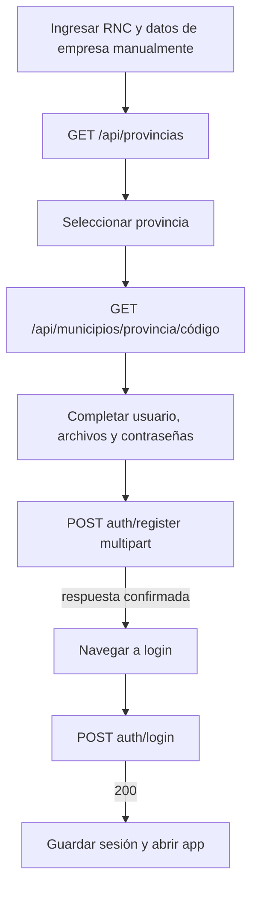
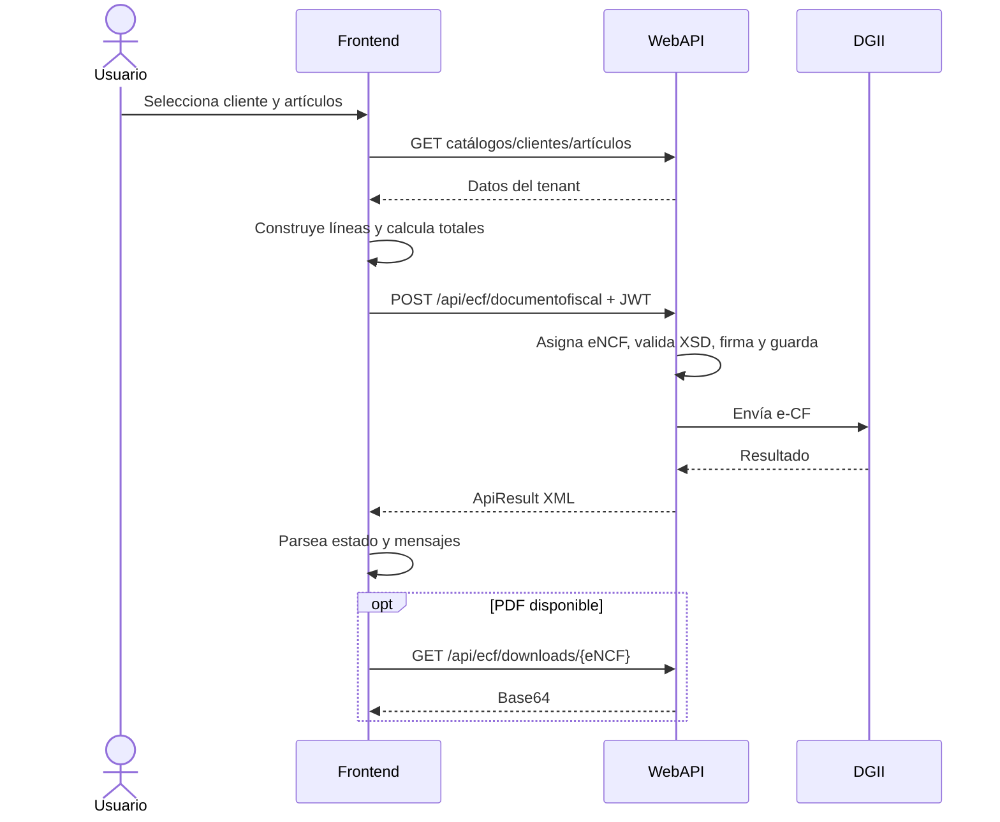

# Guía de integración WebAPI → Frontend

Documento actualizado a partir del código vigente del repositorio el **2 de agosto de 2026**. Esta es la fuente de verdad para que Codex implemente el frontend de OceanOne/Effisort.

Archivos complementarios:

- [`api-types.ts`](./api-types.ts): contratos TypeScript reutilizables.
- [`examples/login.json`](./examples/login.json): login.
- [`examples/cliente.json`](./examples/cliente.json): alta/edición de cliente.
- [`examples/articulo.json`](./examples/articulo.json): alta/edición de artículo.
- [`examples/ecf-documento.json`](./examples/ecf-documento.json): estructura JSON de emisión e-CF.
- [`examples/requests.http`](./examples/requests.http): llamadas ejecutables con REST Client.

## 1. Reglas globales

| Concepto | Comportamiento actual |
|---|---|
| Base URL local HTTP | `http://localhost:5203` |
| Base URL local HTTPS | `https://localhost:7253` |
| Prefijo | `/api` |
| Swagger | `/swagger`, únicamente en `Development` |
| JSON | `camelCase` con `System.Text.Json` |
| Autenticación | JWT Bearer |
| Vida del JWT | 2 horas |
| Tenant | Claim JWT `Tenant_ID` |
| Validación JWT | Firma, expiración, issuer y audience |
| Rate limit | 300 solicitudes por IP durante 2 minutos |
| CORS | Cualquier origen/header, pero sólo métodos `GET` y `POST` |
| Excluido del build | `DgiiController.cs` y `Controllers/ECF/**` |

### 1.1 Tipos de respuesta

La API no tiene un sobre uniforme:

- JSON para auth, catálogos, clientes, artículos, empresas y documentos.
- `ProblemDetails` JSON en conflictos de clientes/artículos.
- `ValidationProblemDetails` JSON en validaciones automáticas.
- Texto plano en muchos éxitos y errores.
- XML en procesos e-CF.
- Base64 como texto para descarga de PDF.
- Cuerpo vacío en `204`, algunos `200`, `401`, `403` y `404`.

No llamar siempre `response.json()`. El adaptador debe leer primero texto y decidir por `Content-Type`.

```ts
export async function parseApiResponse(response: Response): Promise<unknown> {
  const text = await response.text();
  if (!text) return undefined;

  const contentType = response.headers.get("content-type") ?? "";
  if (contentType.includes("json")) {
    try {
      return JSON.parse(text);
    } catch {
      return text;
    }
  }

  return text;
}
```

### 1.2 Autorización

Existen cuatro niveles efectivos:

| Nivel | Rutas |
|---|---|
| Público explícito | Auth, catálogos y endpoints de roles |
| JWT, cualquier usuario | Clientes, artículos, documentos fiscales y TokenInspector |
| JWT + rol exacto `SUPERADMIN` | Sólo `GET /api/empresas` |
| JWT efectivo por comprobación manual | `/api/ecf/*`, aunque el controlador no declare `[Authorize]` |
| Público por falta de atributo | Empresa por ID/RNC y administración de roles |

Header:

```http
Authorization: Bearer eyJ...
```

Claims relevantes:

- Email.
- Nombre/display name.
- Rol: puede aparecer como `role` o URI de claims Microsoft al decodificar.
- `Tenant_ID`: GUID del tenant.
- `exp`: expiración Unix del token.
- `iss` y `aud`: deben coincidir con `JwtSettings` del backend.

Cada rol se emite ahora como un claim `role` independiente. Ya no se concatenan varios roles en una sola cadena.

No existe refresh token ni endpoint de logout.

### 1.3 Restricción CORS que afecta al frontend

El backend sólo permite `GET` y `POST` en CORS. Los nuevos endpoints de clientes y artículos también usan `PUT` y `DELETE`.

Consecuencia:

- Mismo origen o proxy de desarrollo: pueden funcionar.
- Frontend en otro origen: el navegador bloqueará `PUT` y `DELETE` en el preflight hasta ampliar CORS.

Codex debe implementar esas operaciones normalmente, pero documentar el bloqueo en el entorno de integración; no sustituirlas por métodos distintos.

## 2. Índice completo de endpoints

### 2.1 Auth

| Método | Ruta | Seguridad | Entrada | Salida principal |
|---|---|---|---|---|
| POST | `/api/auth/login` | Pública | JSON | `{ token }` |
| POST | `/api/auth/register` | Pública | `multipart/form-data` | Contrato inestable: el controlador devuelve `Ok(Task)` |
| POST | `/api/auth/forgot-password` | Pública | JSON | Texto |
| POST | `/api/auth/reset-password` | Pública | JSON | Texto |

### 2.2 Clientes

Todas requieren JWT y se filtran por el tenant del token.

| Método | Ruta | Uso |
|---|---|---|
| GET | `/api/clientes?incluirInactivos=false` | Listado |
| GET | `/api/clientes/{id}` | Detalle por GUID |
| GET | `/api/clientes/rnc/{rnc}` | Detalle por RNC |
| POST | `/api/clientes` | Crear |
| PUT | `/api/clientes/{id}` | Reemplazar campos editables |
| DELETE | `/api/clientes/{id}` | Baja lógica |

### 2.3 Artículos

Todas requieren JWT y se filtran por el tenant del token.

| Método | Ruta | Uso |
|---|---|---|
| GET | `/api/articulos?incluirInactivos=false` | Listado |
| GET | `/api/articulos/{id}` | Detalle por GUID |
| GET | `/api/articulos/codigo/{codigo}` | Detalle por código |
| POST | `/api/articulos` | Crear |
| PUT | `/api/articulos/{id}` | Reemplazar campos editables |
| DELETE | `/api/articulos/{id}` | Baja lógica |

### 2.4 Catálogos públicos

| Recurso | Listado | Detalle |
|---|---|---|
| Formas de pago | `GET /api/formaspago` | `GET /api/formaspago/{id}` |
| Indicadores facturación | `GET /api/indicadoresfacturacion` | `GET /api/indicadoresfacturacion/{id}` |
| Indicadores retención | `GET /api/indicadoresretencion` | `GET /api/indicadoresretencion/{id}` |
| Medidas | `GET /api/medidas` | `GET /api/medidas/{id}` |
| Monedas | `GET /api/monedas` | `GET /api/monedas/{id}` |
| Países | `GET /api/paises` | `GET /api/paises/{id}` |
| Términos de pago | `GET /api/terminospagos` | `GET /api/terminospagos/{id}` |
| Tipos de ajuste | `GET /api/tiposajustes` | `GET /api/tiposajustes/{id}` |
| Tipos de comprobante | `GET /api/tiposcomprobantes` | `GET /api/tiposcomprobantes/{id}` |
| Impuestos adicionales | `GET /api/tiposimpuestosadicionales` | `GET /api/tiposimpuestosadicionales/{id}` |
| Tipos de ingreso | `GET /api/tiposingresos` | `GET /api/tiposingresos/{id}` |
| Tipos de modificación | `GET /api/tiposmodificaciones` | `GET /api/tiposmodificaciones/{id}` |
| Tipos de pago | `GET /api/tipospagos` | `GET /api/tipospagos/{id}` |
| Provincias | `GET /api/provincias` | No existe |
| Municipios | `GET /api/municipios` | `GET /api/municipios/provincia/{codigo}` |

### 2.5 DGII (no disponible en el build actual)

`webapi.csproj` excluye `Controllers/DgiiController.cs` mediante `<Compile Remove>`. Las rutas siguientes existen solamente en el archivo fuente: la aplicación compilada responde `404` y Swagger no las muestra.

| Método | Ruta | Estado actual |
|---|---|---|
| GET | `/api/dgii/consulta-rnc?rnc=...` | No registrada; `404` |
| GET | `/api/dgii/consulta-provincias` | No registrada; `404` |
| GET | `/api/dgii/consulta-municipios?provincia=...` | No registrada; `404` |
| POST | `/api/dgii/upload-provincias-csv` | No registrada; `404` |
| POST | `/api/dgii/upload-municipios-csv` | No registrada; `404` |
| POST | `/api/dgii/upload-rnc-zip` | No registrada; `404` |
| POST | `/api/dgii/split-excel-xml` | No registrada; `404` |

### 2.6 Empresas y documentos fiscales

| Método | Ruta | Seguridad |
|---|---|---|
| GET | `/api/empresas` | Rol `SUPERADMIN` |
| GET | `/api/empresas/{id}` | Pública actualmente |
| GET | `/api/empresas/rnc/{rnc}` | Pública actualmente |
| GET | `/api/documentosfiscales/search` | JWT |
| GET | `/api/documentosfiscales` | JWT |
| GET | `/api/documentosfiscales/{id}` | JWT |
| GET | `/api/documentosfiscales/comprador/{rnc}` | JWT |

### 2.7 e-CF

| Método | Ruta | Entrada/salida |
|---|---|---|
| POST | `/api/ecf/documentofiscal` | JSON → XML |
| POST | `/api/ecf/consultartrackid?trackId=...` | Query → XML |
| GET | `/api/ecf/downloads/{numero}` | Base64 texto |
| POST | `/api/ecf/ecf` | XML multipart → XML ARECF |
| POST | `/api/ecf/emision-aprobacion-comercial` | JSON → vacío |
| POST | `/api/ecf/generar-pdf` | JSON → texto |

### 2.8 Roles e inspección JWT

| Método | Ruta | Seguridad |
|---|---|---|
| POST | `/api/roles/create` | Pública actualmente |
| POST | `/api/roles/assign?userId=...&roleName=...` | Pública actualmente |
| POST | `/api/roles/remove?userId=...&roleName=...` | Pública actualmente |
| GET | `/api/roles/user/{userId}/roles` | Pública actualmente |
| GET | `/api/roles/list` | Pública actualmente |
| DELETE | `/api/roles/delete/{roleName}` | Pública actualmente |
| GET | `/api/tokeninspector/claims` | JWT |
| GET | `/api/tokeninspector/check-auth` | JWT |

### 2.9 Controladores excluidos

- `POST /api/emision/EmisionComprobantes` sólo existe en `Controllers/ECF/EmisionController.cs`.
- `POST /api/recepcion/fe/RecepcionComprobantes` sólo existe en `Controllers/ECF/RecepcionController.cs`.

La carpeta completa `Controllers/ECF/**` está excluida por `webapi.csproj`. Ninguna de estas rutas se registra, ambas devuelven `404` y no deben formar parte de la integración. Esto no afecta a `Controllers/EcfController.cs`, que sí contiene las rutas activas `/api/ecf/*` documentadas arriba.

## 3. Autenticación y registro

### 3.1 Login

`POST /api/auth/login`

```json
{
  "email": "admin@empresa.com",
  "password": "Secreto123"
}
```

Validación:

- `email`: requerido y formato email.
- `password`: requerido.
- El login ya no solicita RNC.

Éxito `200 application/json`:

```json
{
  "token": "eyJhbGciOiJIUzI1NiIs..."
}
```

Errores `401`, texto:

```text
Usuario no encontrado
```

o:

```text
Credenciales inválidas
```

El frontend debe descartar sesiones cuyo JWT no tenga `Tenant_ID`, porque clientes, artículos y e-CF dependen de él.

### 3.2 Registro

`POST /api/auth/register`

La entrada es **`multipart/form-data`**, no JSON. Nombres exactos:

| Campo | Obligatorio | Regla |
|---|---:|---|
| `Rnc` | Sí | Máximo 11 |
| `RazonSocial` | Sí | Máximo 80 |
| `ActividadEconomica` | Sí | Máximo 100 |
| `ProvinciaId` | Sí | Exactamente 6 |
| `MunicipioId` | Sí | Exactamente 6 |
| `FullName` | Sí | El controlador actualmente no lo usa |
| `PhoneNumber` | Sí | Sin validación de formato |
| `UserName` | Sí | Mínimo 6 |
| `Email` | Sí | Formato email |
| `ConfirmEmail` | Sí | Formato email; backend no compara igualdad |
| `Password` | Sí | Mínimo 6 |
| `ConfirmPassword` | Sí | Mínimo 6 y debe coincidir |
| `LogoEmpresa` | No | PNG esperado |
| `CertificadoFirmaDigital` | No | P12, MIME `application/x-pkcs12` esperado |
| `PasswordCertificadoFirmaDigital` | No | Texto |

Ejemplo:

```ts
const form = new FormData();
form.append("Rnc", values.rnc);
form.append("RazonSocial", values.razonSocial);
form.append("ActividadEconomica", values.actividadEconomica);
form.append("ProvinciaId", values.provinciaId);
form.append("MunicipioId", values.municipioId);
form.append("FullName", values.fullName);
form.append("PhoneNumber", values.phoneNumber);
form.append("UserName", values.userName);
form.append("Email", values.email);
form.append("ConfirmEmail", values.confirmEmail);
form.append("Password", values.password);
form.append("ConfirmPassword", values.confirmPassword);
form.append("PasswordCertificadoFirmaDigital", values.passwordCertificado ?? "");
if (values.logo) form.append("LogoEmpresa", values.logo);
if (values.certificado) form.append("CertificadoFirmaDigital", values.certificado);

await fetch(`${API_URL}/api/auth/register`, {
  method: "POST",
  body: form,
});
```

No establecer manualmente `Content-Type`; el navegador debe incluir el boundary.

El resultado de negocio que intenta producir el servicio es:

```json
{
  "id": "c88c7491-9875-4bc2-8977-23c932b98242",
  "userName": "oceanadmin",
  "email": "admin@empresa.com",
  "password": "Secreto123",
  "message": "Empresa registrada exitosamente"
}
```

Sin embargo, el controlador actual hace `Ok(_authService.Registrar(model))` sin `await`: envuelve un `Task` dentro de la respuesta. Por eso el payload HTTP real no debe considerarse estable; puede serializar metadatos del task o fallar durante la serialización. El frontend no debe cerrar el flujo de registro basándose en la forma anterior hasta corregir ese `await`.

Si llega a recibirse el resultado pretendido, expone `password`. El frontend debe ignorar esa propiedad, no registrarla y no persistirla.

Errores frecuentes `400` texto:

- Email o username ya usados.
- Empresa ya registrada.
- Contraseñas distintas.
- Rol por defecto ausente.
- Errores de modelo, generalmente `ValidationProblemDetails`.

El registro no devuelve JWT. Después de `200`, navegar al login.

### 3.3 Recuperación

`POST /api/auth/forgot-password`

```json
{
  "email": "admin@empresa.com"
}
```

Éxito: `200` texto `Correo enviado para restablecer contraseña`. Usuario inexistente: `400` texto `Usuario no encontrado`. El token se crea con expiración de 2 horas y el enlace apunta a:

```text
https://effisort.com/reset-password?token=...
```

`POST /api/auth/reset-password`

```json
{
  "email": "admin@empresa.com",
  "resetCode": "token-del-enlace",
  "newPassword": "NuevaClave123"
}
```

El backend consulta `resetCode` y no contrasta `email`. Token inválido/expirado: `400` texto. Éxito: `200` texto.

Advertencia: el reset escribe un hash BCrypt, mientras el login actual valida con `PasswordHasher<ApplicationUser>`. Una contraseña restablecida puede no ser aceptada por login hasta corregir esa incompatibilidad.

Además, el usuario de Identity tiene clave primaria `string`, pero el servicio de reset intenta localizarlo pasando un `Guid`. El flujo debe considerarse no operativo hasta comprobar/corregir ambos puntos.

## 4. Clientes

Modelo: `Cliente` en `api-types.ts`.

Validaciones relevantes:

| Campo | Obligatorio | Máximo/formato |
|---|---:|---|
| `razonSocialComprador` | Sí | 150 |
| `rncComprador` | No | 11 |
| `identificadorExtranjero` | No | 20 |
| `contactoComprador` | No | 80 |
| `correoComprador` | No | Email, 80 |
| `direccionComprador` | No | 100 |
| `municipioComprador` | No | 10 |
| `provinciaComprador` | No | 10 |
| `paisComprador` | No | 60 |
| `fechaEntrega` | No | String, 10 |
| `contactoEntrega` / `direccionEntrega` | No | 100 |
| `telefonoAdicional` | No | 12 |
| `codigoInternoComprador` | No | 20 |
| `responsablePago` | No | 20 |
| `informacionAdicionalComprador` | No | 150 |
| `activo` | Sí | Boolean |

### 4.1 Listado

```http
GET /api/clientes
GET /api/clientes?incluirInactivos=true
Authorization: Bearer <token>
```

- Default: sólo `activo=true`.
- Orden: `razonSocialComprador`.
- Respuesta: `200 Cliente[]`; vacío es `[]`.

### 4.2 Consultas

- `GET /api/clientes/{guid}`
- `GET /api/clientes/rnc/{rnc}`

Devuelven `200 Cliente` o `404` vacío. RNC y código interno se guardan con espacios extremos eliminados.

### 4.3 Crear

`POST /api/clientes`

```json
{
  "rncComprador": "131234567",
  "identificadorExtranjero": null,
  "razonSocialComprador": "Cliente Ejemplo SRL",
  "contactoComprador": "María Pérez",
  "correoComprador": "compras@cliente.com",
  "direccionComprador": "Av. Principal 123",
  "municipioComprador": "010101",
  "provinciaComprador": "010000",
  "paisComprador": "DO",
  "fechaEntrega": null,
  "contactoEntrega": "Almacén",
  "direccionEntrega": "Av. Principal 123",
  "telefonoAdicional": "8095550101",
  "codigoInternoComprador": "CLI-0001",
  "responsablePago": "María Pérez",
  "informacionAdicionalComprador": null,
  "tipoPrecio": 1,
  "tipoPago": 1,
  "terminoPago": 30,
  "activo": true
}
```

El servidor sobrescribe `id` y `tenantId`; se recomienda no enviarlos al crear. Los campos `ultimaFecha`, `ultimoUsuario` y `cuentaContable` ya no existen en el modelo actual.

Éxito: `201 Cliente` y header `Location`. Conflicto de RNC o código interno dentro del mismo tenant: `409 application/problem+json`.

```json
{
  "title": "No se pudo crear el cliente.",
  "status": 409,
  "detail": "Ya existe un cliente con el RNC '131234567'."
}
```

### 4.4 Actualizar

`PUT /api/clientes/{id}`

Enviar todos los campos editables, no sólo los modificados: el servicio reemplaza cada propiedad con el body.

- `200 Cliente`: actualizado.
- `404`: no existe en el tenant.
- `409 ProblemDetails`: RNC o código interno duplicado.

### 4.5 Eliminar/reactivar

`DELETE /api/clientes/{id}` realiza baja lógica:

- Cambia `activo=false`.
- `204` sin cuerpo si existe.
- `404` si no existe en el tenant.

Para reactivar, listar con `incluirInactivos=true` y hacer `PUT` del objeto completo con `activo=true`.

## 5. Artículos

Modelo: `Articulo` en `api-types.ts`.

Validaciones relevantes:

| Campo | Obligatorio | Máximo/formato |
|---|---:|---|
| `codigo` | No | 35, único por tenant si existe |
| `tipoCodigo` | No | 14 |
| `indicadorFacturacion` | Sí | Entero |
| `nombreItem` | Sí | 80 |
| `indicadorBienoServicio` | Sí | Entero |
| `descripcionItem` | No | 1000 |
| `unidadMedida` | Sí | Entero |
| `precioUnitarioItem` | Sí | Decimal |
| `existencia` | Sí | Decimal |
| `codigoImpuesto` | No | 100 |
| `activo` | Sí | Boolean |

### 5.1 Listado y consultas

```http
GET /api/articulos
GET /api/articulos?incluirInactivos=true
GET /api/articulos/{guid}
GET /api/articulos/codigo/{codigo}
```

- Listado default: activos.
- Orden: `nombreItem`.
- Detalle ausente: `404` vacío.

### 5.2 Crear

`POST /api/articulos`

```json
{
  "codigo": "ART-0001",
  "tipoCodigo": "INT",
  "indicadorFacturacion": 1,
  "nombreItem": "Servicio de consultoría",
  "indicadorBienoServicio": 2,
  "descripcionItem": "Consultoría mensual",
  "unidadMedida": 43,
  "precioUnitarioItem": 1500.00,
  "existencia": 0,
  "codigoImpuesto": "ITBIS18",
  "cantidadReferencia": null,
  "unidadReferencia": null,
  "gradosAlcohol": null,
  "precioUnitarioReferencia": null,
  "activo": true
}
```

El servidor sobrescribe tenant e ID. Código vacío/espacios se convierte en `null`. Código repetido en el tenant: `409 ProblemDetails`. Éxito: `201 Articulo`. Los campos `ultimaFecha` y `ultimoUsuario` ya no existen.

### 5.3 Actualizar y eliminar

`PUT /api/articulos/{id}` reemplaza los campos editables y devuelve `200`, `404` o `409`.

`DELETE /api/articulos/{id}` hace baja lógica y devuelve `204` o `404`. Reactivar con `PUT activo=true`.

Los campos numéricos no-null (`indicadorFacturacion`, `indicadorBienoServicio`, `unidadMedida`, `precioUnitarioItem`, `existencia`) deben validarse en cliente; si se omiten pueden enlazarse como `0`, aunque sea fiscalmente inválido.

## 6. Catálogos

Todos son públicos, no paginados y actualmente no filtran por tenant.

| Tipo TypeScript | Forma JSON |
|---|---|
| `FormaPago` | `{ id, tenantId, codigo, descripcion, activo }` |
| `IndicadorFacturacion` | `{ id, tenantId, codigo, descripcion, tasaItbis, activo }` |
| `IndicadorRetencion` | `{ id, tenantId, codigo, nombre, activo }` |
| `Medida` | `{ id, tenantId, codigo, abreviatura, medidaNombre, activo }` |
| `Moneda` | `{ id, tenantId, codigo, descripcion, activo }` |
| `Pais` | `{ id, tenantId, codigo, nombre, activo }` |
| `Provincia` | `{ id, tenantId, codigo, nombre, activo }` |
| `Municipio` | `{ id, tenantId, codigo, nombre, provinciaCodigo, activo }` |
| `TerminoPago` | `{ id, tenantId, codigo, nombre, activo }` |
| `TipoAjuste` | `{ id, tenantId, codigo, nombre, activo }` |
| `TipoComprobante` | `{ id, tenantId, tipo, ecf, activo }` |
| `TipoImpuestoAdicional` | `{ id, tenantId, codigo, tipoImpuesto, abreviatura, descripcion, tasa, tipoMontoPorcentaje, activo }` |
| `TipoIngreso` | `{ id, tenantId, codigo, descripcion, activo }` |
| `TipoModificacion` | `{ id, tenantId, codigo, descripcion, activo }` |
| `TipoPago` | `{ id, tenantId, codigo, nombre, activo }` |

Listados retornan `200 []` si no hay datos. Detalles retornan `404` vacío. Municipios por provincia también retorna `200 []`, porque la consulta nunca produce `null`.

No confundir:

- `/api/provincias` y `/api/municipios`: SQL Server, objetos con GUID/tenant.
- Las antiguas consultas `/api/dgii/consulta-provincias` y `consulta-municipios` apuntan a SQLite en el código fuente, pero el controlador DGII no se compila actualmente.

Para registro se esperan códigos de 6 caracteres, no GUID. En el build actual se deben obtener de `GET /api/provincias` y `GET /api/municipios/provincia/{codigoProvincia}`.

## 7. DGII: contrato fuente no disponible

**No integrar estas rutas como activas.** El proyecto contiene `Controllers/DgiiController.cs`, pero `webapi.csproj` tiene `<Compile Remove="Controllers\DgiiController.cs" />`. En consecuencia, todas responden `404` y no aparecen en Swagger.

Los contratos siguientes se conservan únicamente como referencia para una futura reactivación del controlador.

### 7.1 Consultas definidas en el archivo excluido

`GET /api/dgii/consulta-rnc?rnc=101234567`

```json
{
  "rnc": "101234567",
  "razonSocial": "EMPRESA EJEMPLO SRL",
  "actividadEconomica": "SERVICIOS",
  "fechaInicioOperaciones": "01/01/2020",
  "estado": "ACTIVO",
  "regimenPago": "NORMAL"
}
```

Si el controlador se reactiva, un RNC no encontrado se representa como `404` texto.

`GET /api/dgii/consulta-provincias`

```json
[
  { "codigo": "010000", "nombre": "DISTRITO NACIONAL" }
]
```

`GET /api/dgii/consulta-municipios?provincia=010000`

```json
[
  {
    "codigo": "010101",
    "nombre": "SANTO DOMINGO DE GUZMÁN",
    "provinciaCodigo": "010000"
  }
]
```

Si el controlador se reactiva, sin filas devuelve `404` texto, no arreglo vacío.

### 7.2 Cargas definidas en el archivo excluido

Todas están diseñadas para recibir `multipart/form-data`, campo `file`. Actualmente ninguna ruta está registrada.

| Endpoint | MIME exacto |
|---|---|
| `upload-provincias-csv` | `text/csv` |
| `upload-municipios-csv` | `text/csv` |
| `upload-rnc-zip` | `application/x-zip-compressed` |
| `split-excel-xml` | `application/vnd.openxmlformats-officedocument.spreadsheetml.sheet` |

Si el controlador se reactiva sin otros cambios, quedarían públicas porque su autorización está comentada. El frontend no debe ofrecer la pantalla de carga mientras continúen excluidas.

## 8. Empresas

Los permisos actuales son distintos por acción:

- `GET /api/empresas`: exige rol exacto `SUPERADMIN`; devuelve todas las empresas sin tenant filter.
- `GET /api/empresas/{guid}`: público actualmente.
- `GET /api/empresas/rnc/{rnc}`: público actualmente.

Las consultas por ID/RNC devuelven `401 Unauthorized` cuando no encuentran la empresa, no `404`.

La respuesta contiene configuración sensible, incluyendo `passwordCertificado` y `emailPassword`. El frontend no debe loguear, persistir ni mostrar esos campos.

## 9. Documentos fiscales

Requieren cualquier JWT válido y actualmente consultan globalmente, sin filtro automático del tenant del JWT.

### 9.1 Búsqueda

`GET /api/documentosfiscales/search`

Query opcional:

- `tenantId`
- `encfTipo`
- `rncEmisor`
- `rncComprador`
- `idExtranjero`
- `fechaEmision`
- `correoComprador`
- `estadoEncf`
- `pageNumber` default 1
- `pageSize` default 10, máximo 25

Los filtros usan `Contains`. No hay orden definido.

```json
{
  "totalItems": 42,
  "pageNumber": 1,
  "pageSize": 10,
  "totalPages": 5,
  "items": []
}
```

No enviar página/tamaño menores de 1.

### 9.2 Otras consultas

- `GET /api/documentosfiscales`: todo, sin paginar.
- `GET /api/documentosfiscales/{id}`: ID entero.
- `GET /api/documentosfiscales/comprador/{rnc}`: `404` si no hay filas, no `[]`.

Varias fechas del documento son strings no normalizados. Sólo `createdAt` y `updatedAt` son timestamps JSON.

## 10. e-CF

### 10.1 Seguridad efectiva

`EcfController` no declara `[Authorize]`. `ITenantScoped` asigna un GUID reservado al usuario anónimo y cada acción comprueba manualmente si falta tenant.

Tratar todas las rutas `/api/ecf/*` como JWT. Sin token responden `401` con el texto `Tenant information is missing in the JWT token or user not authenticated.`. Incluso `/api/ecf/generar-pdf`, marcado `[AllowAnonymous]`, realiza esta comprobación y exige un tenant válido.

### 10.2 Emitir documento desde JSON

`POST /api/ecf/documentofiscal`

Body completo: `EcfRequest` en `api-types.ts`. Ejemplo estructural: `examples/ecf-documento.json`.

Propiedades mínimas del modelo C#:

- `ecf`
- `ecf.encabezado.idDoc.tipoeCF`
- Emisor: `rncEmisor`, `razonSocialEmisor`, `direccionEmisor`
- `detallesItems.item`
- Por línea: `numeroLinea`, `indicadorFacturacion`, `nombreItem`, `indicadorBienoServicio`

El XSD fiscal puede exigir más campos según el tipo. El ejemplo es de integración, no certifica cumplimiento DGII.

Si `eNCF` viene vacío o se omite, el servidor asigna secuencia y vencimiento.

Éxito: `200 text/xml`.

```xml
<ApiResult>
  <Encf>E310000000001</Encf>
  <FechaEmision>26-07-2026</FechaEmision>
  <FechaVencimientoSecuencia>31-12-2028</FechaVencimientoSecuencia>
  <FechaFirma>...</FechaFirma>
  <CodigoSeguridad>...</CodigoSeguridad>
  <EstadoEncf>Aceptado</EstadoEncf>
  <SecuenciaUtilizada>true</SecuenciaUtilizada>
  <UrlVerificacionDGII>...</UrlVerificacionDGII>
  <UrlDocumentoPdf>...</UrlDocumentoPdf>
  <Mensajes><Mensaje>...</Mensaje></Mensajes>
</ApiResult>
```

Las URLs pueden ser el literal `None`. Errores: principalmente `400` texto; excepciones no controladas pueden ser `500`.

### 10.3 Consultar TrackId

```http
POST /api/ecf/consultartrackid?trackId=abc-123
Authorization: Bearer <token>
```

`trackId` va en query, no JSON. Éxito: XML. Error/configuración ausente: `400` texto.

### 10.4 Descargar PDF

```http
GET /api/ecf/downloads/E310000000001
```

Éxito: Base64 como texto, no JSON ni bytes.

```ts
const base64 = await response.text();
const binary = atob(base64);
const bytes = Uint8Array.from(binary, char => char.charCodeAt(0));
const blob = new Blob([bytes], { type: "application/pdf" });
const url = URL.createObjectURL(blob);
```

Tipos soportados: `E31`, `E32`, `E33`, `E34`, `E41`, `E43`, `E44`, `E45`, `E46`, `E47`.

### 10.5 Recibir e-CF XML

`POST /api/ecf/ecf`

- `multipart/form-data`.
- Campo `xml`.
- MIME exacto `application/xml` o `text/xml`.
- Rechaza archivo vacío y nombre ya existente.
- Éxito: XML ARECF firmado.

### 10.6 Aprobación comercial

Emitir aprobación:

`POST /api/ecf/emision-aprobacion-comercial`

```json
{
  "rncEmisor": "101234567",
  "rncComprador": "131234567",
  "encf": "E310000000001"
}
```

Éxito: `200` vacío. Error: `400` texto.

El endpoint anterior `/api/ecf/recepcionaprobacioncomercial` fue eliminado. No existe endpoint para registrar la decisión comercial (`01` aceptado, `02` rechazado/motivo) antes de emitirla. El frontend puede diseñar la UI, pero no completar esos pasos con la API actual.

### 10.7 Generar PDF

`POST /api/ecf/generar-pdf`

```json
{
  "tenantId": "00000000-0000-0000-0000-000000000000",
  "encf": "E310000000001"
}
```

`tenantId` del body no se usa; se toma del JWT. Devuelve texto con una ruta interna. Para visualizar/descargar usar `/downloads/{numero}`.

## 11. Roles e inspección del JWT

### 11.1 Administración de roles

El controlador no tiene `[Authorize]`; todas estas operaciones están públicas en el código vigente. Esto es un riesgo crítico y el frontend normal no debe exponerlas fuera de una pantalla administrativa controlada, aunque la API todavía no lo haga.

Crear rol:

```http
POST /api/roles/create
Content-Type: application/json

"TENANT_LISTS_ADMIN"
```

El body es un **string JSON**, no `{ "roleName": ... }`. Devuelve el rol creado/existente como JSON.

```json
{
  "id": "role-id",
  "name": "TENANT_LISTS_ADMIN",
  "normalizedName": "TENANT_LISTS_ADMIN",
  "concurrencyStamp": "...",
  "userRoles": null
}
```

Asignar o remover rol:

```http
POST /api/roles/assign?userId={id}&roleName=TENANT_LISTS_ADMIN
POST /api/roles/remove?userId={id}&roleName=TENANT_LISTS_ADMIN
```

Los parámetros van en query. Usuario inexistente: `404` texto. Éxito: `200` texto.

Consultar:

```http
GET /api/roles/user/{userId}/roles
GET /api/roles/list
```

La primera devuelve `string[]`; la segunda, `ApplicationRole[]`.

Eliminar:

```http
DELETE /api/roles/delete/{roleName}
```

Devuelve `200` texto incluso si el rol no existía. Desde otro origen, el `DELETE` está bloqueado por la política CORS actual.

### 11.2 Inspección del token

Ambas rutas exigen JWT y son útiles para comprobar la sesión durante integración:

`GET /api/tokeninspector/claims`

```json
[
  { "type": ".../nameidentifier", "value": "user-id" },
  { "type": ".../name", "value": "Nombre" },
  { "type": "Tenant_ID", "value": "tenant-guid" },
  { "type": "role o URI de rol Microsoft", "value": "TENANT_LISTS_ADMIN" }
]
```

`GET /api/tokeninspector/check-auth`

```json
{
  "isAuthenticated": true,
  "userName": "Nombre",
  "claims": [
    { "type": "Tenant_ID", "value": "tenant-guid" }
  ]
}
```

Estas rutas son de diagnóstico; no deben sustituir la validación local de `exp` ni usarse antes de cada solicitud.

## 12. Flujos funcionales

### 12.1 Registro y primera sesión



Reglas:

1. Comparar `email === confirmEmail` en frontend; backend no lo hace.
2. Enviar códigos de provincia/municipio de seis caracteres.
3. Validar logo PNG y certificado P12 antes de crear `FormData`.
4. Bloquear doble submit. El registro hace varias escrituras sin transacción única.
5. Ante timeout/`500`, no reintentar automáticamente; puede existir creación parcial.
6. Mientras falte el `await` del controlador, tratar la respuesta de registro como inestable y verificar el resultado antes de navegar.
7. Ignorar el password si aparece en la respuesta.
8. Iniciar sesión separadamente.

La consulta automática de RNC no está disponible porque `DgiiController` está excluido del build. Mantener ese autocompletado detrás de una interfaz/adaptador para activarlo en el futuro, pero permitir captura manual ahora.

El rol por defecto `TENANT_LISTS_ADMIN` se guarda en la tabla relacional propia `UsuariosTenantsRoles`, pero login lee roles de `AspNetUserRoles`. Un recién registrado puede recibir un token sin claims `role`: podrá usar rutas `[Authorize]` como clientes/artículos/documentos, pero no `GET /api/empresas`, que exige `SUPERADMIN`.

### 12.2 Sesión

1. Login por email/password.
2. Guardar token según la política de seguridad del frontend.
3. Decodificar `exp`, `Tenant_ID`, nombre y rol sólo para UI.
4. Adjuntar Bearer a llamadas protegidas.
5. Al recibir `401`, limpiar sesión y redirigir al login.
6. En `403`, mantener sesión y mostrar “sin permisos”.
7. En `429`, no cerrar sesión; esperar y reintentar únicamente operaciones idempotentes.

### 12.3 CRUD de clientes

```text
Login → GET clientes → buscar/crear → POST → detalle
→ PUT para editar o reactivar → DELETE para desactivar
```

- La precarga por RNC no está disponible mediante esta API mientras `DgiiController` siga excluido; permitir captura manual.
- Tratar `409` como validación de unicidad.
- Después de `DELETE 204`, remover del listado activo sin volver a parsear body.
- Para gestión de inactivos: `incluirInactivos=true`.
- Al editar, enviar el objeto completo.

### 12.4 CRUD de artículos

```text
Login → cargar catálogos fiscales → GET artículos
→ POST/PUT artículo → usarlo como plantilla de línea e-CF
```

- Indicador, medida e impuesto deben derivarse de catálogos.
- Código es opcional pero único cuando existe.
- `DELETE` desactiva; `PUT activo=true` reactiva.
- No usar existencia negativa salvo regla explícita del producto.

### 12.5 Emisión e-CF



Estados de UI:

| Estado | Condición |
|---|---|
| Borrador | No enviado |
| Enviando | POST pendiente; bloquear duplicados |
| Error de validación | `400`, permitir corregir |
| Procesado | XML recibido |
| Aceptado | `EstadoEncf` contiene `Aceptado` |
| Rechazado | `EstadoEncf` contiene `Rechazado` |
| Resultado desconocido | Timeout o `500`; verificar antes de reenviar |

El `trackId` no viene en el XML de emisión. Sólo consultar seguimiento si se obtuvo del registro `DocumentoFiscal` u otra fuente confiable.

### 12.6 Bandeja fiscal

1. Requiere cualquier JWT válido.
2. Iniciar `search?pageNumber=1&pageSize=10`.
3. Debounce en filtros; reiniciar página al cambiar filtro.
4. Usar `totalItems` y `totalPages`.
5. Traducir `404` de búsqueda por comprador a estado vacío.
6. Descargar por e-NCF cuando esté disponible.

### 12.7 Recepción y aprobación

```text
Subir e-CF XML → recibir ARECF firmado → revisar comprobante
→ [recepción/decisión no implementadas] → emitir ACECF existente
```

No habilitar como completado el botón aceptar/rechazar hasta existir un endpoint de decisión. La recepción de ACECF también debe interpretar `200 "HTTP 400"` como error lógico.

## 13. Manejo común de resultados

| Resultado | Acción frontend |
|---|---|
| `200/201` JSON | Parsear forma documentada |
| `200` XML | Parsear con `DOMParser`, verificar `parsererror` |
| `200` texto | Conservar texto; revisar casos `HTTP 400` |
| `204` | Éxito sin parsear body |
| `400 ValidationProblemDetails` | Mapear `errors` a campos |
| `400` texto | Mensaje de regla/XSD/archivo |
| `401` | Login: credenciales; resto: cerrar sesión |
| `403` | Sin permisos, mantener sesión |
| `404` | Vacío/no encontrado según endpoint |
| `409 ProblemDetails` | Mostrar `detail` junto al campo duplicado |
| `429` | Esperar; no repetir mutaciones automáticamente |
| Timeout/`500` en mutación | Resultado desconocido; verificar antes de repetir |

Modelo recomendado:

```ts
export class ApiError extends Error {
  constructor(
    public readonly status: number,
    public readonly body: unknown,
    public readonly contentType: string,
  ) {
    super(extractApiMessage(body));
  }
}

function extractApiMessage(body: unknown): string {
  if (typeof body === "string") return body;
  if (body && typeof body === "object" && "detail" in body) {
    return String((body as { detail?: unknown }).detail ?? "Error de API");
  }
  return "No fue posible completar la operación.";
}
```

## 14. Arquitectura mínima esperada en el frontend

Codex debe crear:

1. Configuración `API_BASE_URL` por entorno.
2. Cliente HTTP central con Bearer y parser JSON/XML/texto.
3. Store de sesión y guard de autenticación/rol.
4. Módulos:
   - Auth/registro/reset.
   - Clientes.
   - Artículos.
   - Catálogos.
   - Emisión e-CF.
   - Documentos fiscales.
   - Administración de empresas para `SUPERADMIN`.
   - Administración de roles sólo si se autoriza expresamente en el producto.
   - No crear navegación DGII mientras su controlador esté excluido del build.
   - Diagnóstico JWT para entornos de desarrollo.
5. Formularios tipados con validación antes de enviar.
6. Manejo de loading, empty, error y resultado desconocido.
7. Cache de catálogos con invalidación manual.
8. Tests del adaptador para JSON, XML, texto, vacío y ProblemDetails.

Rutas de UI sugeridas:

```text
/login
/registro
/forgot-password
/reset-password
/app/clientes
/app/clientes/nuevo
/app/clientes/:id
/app/articulos
/app/articulos/nuevo
/app/articulos/:id
/app/documentos/nuevo
/app/documentos
/app/documentos/:id
/app/admin/empresas
```

## 15. Hallazgos actuales que Codex no debe ocultar

- CORS no permite `PUT`/`DELETE`.
- Registro retorna la contraseña en texto JSON.
- `ConfirmEmail` no se compara.
- `FullName` no se utiliza para el display name; se usa razón social.
- El tenant duplicado construye un `BadRequest` sin retornarlo y luego reutiliza/actualiza el tenant.
- Registro no es una transacción única.
- El rol de registro se guarda en una relación distinta a la que consulta login.
- JWT ya usa Bearer como esquema predeterminado, valida issuer/audience y emite cada rol como claim independiente.
- El registro devuelve `Ok(Task)` porque falta `await`; su respuesta HTTP no es un contrato estable.
- El rol por defecto del registro se guarda fuera de `AspNetUserRoles`, que es la fuente utilizada al generar el JWT.
- Forgot password ya corta correctamente con `400 "Usuario no encontrado"` cuando el correo no existe.
- Reset y login usan algoritmos de hash incompatibles y el reset busca una clave string con un GUID.
- Los resultados de validación/copia del logo y certificado se ignoran después de crear la empresa; el registro puede responder éxito sin haber copiado el archivo.
- Catálogos, empresas y documentos fiscales no se filtran automáticamente por tenant.
- Clientes y artículos sí están correctamente filtrados por tenant.
- Clientes y artículos ya no contienen auditoría (`ultimaFecha`, `ultimoUsuario`); cliente tampoco contiene `cuentaContable`.
- Empresas exponen secretos de certificado/email.
- Sólo el listado de empresas exige `SUPERADMIN`; empresa por ID/RNC está pública y usa `401` para “no encontrado”.
- Documentos fiscales exige JWT, no `SUPERADMIN`.
- `DgiiController.cs` y `Controllers/ECF/**` están excluidos de la compilación; sus rutas devuelven `404` y no aparecen en Swagger.
- Si se reactivara DGII sin otros cambios, sus cargas quedarían públicas porque el atributo de autorización está comentado.
- Toda la administración de roles está pública actualmente.
- e-CF exige tenant mediante comprobación manual y devuelve `401` sin JWT/tenant.
- `/api/ecf/recepcionaprobacioncomercial` fue eliminado.
- No existe endpoint para guardar aceptación/rechazo comercial.
- PDF se entrega como Base64 texto.
- Swagger sólo está en Development.
- El comentario del rate limit dice 10, pero la configuración real es 300 solicitudes cada 2 minutos.

## 16. Checklist para comenzar

- [ ] Definir `API_BASE_URL`.
- [ ] Confirmar si frontend y API compartirán origen o usarán proxy.
- [ ] Conseguir usuario JWT normal y rol exacto `SUPERADMIN`.
- [ ] Verificar token con `/api/tokeninspector/check-auth` durante integración.
- [ ] Implementar el cliente HTTP multiformato.
- [ ] Copiar/adaptar `api-types.ts`.
- [ ] Implementar auth y guards.
- [ ] Implementar clientes y artículos.
- [ ] Cargar catálogos.
- [ ] Implementar constructor e-CF con validación fiscal.
- [ ] Parsear `ApiResult` XML.
- [ ] Probar PDF Base64.
- [ ] Mantener visibles los bloqueos de la sección 14.
